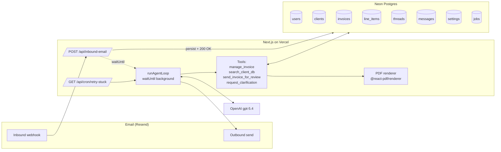

# Invoice Generator — Core App Plan

> **Status:** Draft plan. Not yet implemented. This document is the single source of truth for the first implementation pass and should be consumed by agents who do **not** have the prior planning conversation in context.

---

## 1. What we're building

An AI-powered invoice generator that operates primarily over email.

**Happy path:**

1. A small-business owner (the "user" / "owner") emails `invoice-gen@trimson.ai` with an informal request ("Need to invoice Fable Co for last week's wig fitting, $200 + $25 kit fee").
2. An inbound webhook persists the email and kicks off an agent loop.
3. The agent uses tools to look up the client, draft an invoice record in the database, render it to PDF, and email the draft back to the owner for review.
4. The owner replies with "approved" (or a change request). The agent either marks the invoice approved in the DB and optionally forwards to the client, or revises and loops again.

Multiple entry-point addresses (e.g. `invoice-gen@`, `expense-report@`) may exist over time, each binding the same underlying agent to a different system prompt and tool subset.

**Reference sketch (rough concept, not the committed design):**
`/Users/erikmalkemus/Library/Application Support/LocalHoist/user_images/37693de6-d617-41e6-a5f8-352186cf48c1/original.png`

### Scope for this plan
- Single agent, email-only I/O, invoice generation and revision
- Draft → approved status flow, PDF export, email delivery
- Single-user (auth == inbound email identity match)
- Foundation that can grow into multi-user, multi-persona, Stripe payments, web UI

### Non-goals (for now)
- Web-based chat UI (may add later)
- Authentication beyond email-identity matching (WorkOS planned later)
- Stripe integration (schema reserves fields; no code yet)
- Expense reports (schema/entry-point design must not preclude it; not implemented)
- Multi-tenant hosting as a service

---

## 2. Key design decisions (already made — do not relitigate)

| Decision | Choice | Rationale |
|---|---|---|
| Agent vs. workflow | **Agent** | Free-form email input, the preview→critique→revise loop, and extensibility to future personas all favor an agent over a hand-rolled workflow. |
| Agent framework | **Roll-your-own** on the OpenAI SDK | Loop is ~50 LOC. Avoids framework churn (OpenAI has already deprecated one agent SDK). Zero lock-in. Trivial to swap model providers later. |
| Runtime | **Next.js 15 (App Router) on Vercel** | Matches owner's existing stack. API routes for webhooks + cron. |
| Language | **TypeScript** | Type-safe tools and messages are essential for agent correctness. |
| Database | **Neon Postgres** via the Vercel–Neon integration | Already used, good serverless story. |
| ORM | **Drizzle ORM** | TS-native types, no codegen step, Neon-friendly. |
| LLM | **OpenAI `gpt-5.4`** (configurable via `settings` table) | Current model. Mini is allowed but full-fat is cheap enough at this volume. |
| Email provider | **Resend** on a subdomain of `trimson.ai` (e.g. `billing.trimson.ai`) | Already in use. First-class inbound webhooks. Signed payloads. |
| PDF generator | **`@react-pdf/renderer`** | Pure Node, no Chromium. JSX-authored invoice template. |
| Auth | **None now.** Inbound `From:` header must match a `users.email` row. | Deferred to WorkOS later; schema reserves `user_id` FKs now. |
| Payments | **None now.** Reserve Stripe columns on `invoices`. | Column order in Postgres is fixed at creation; cheaper to add now than `ALTER` later. |
| License | **MIT** | Owner intends this to be open source for self-hosters. |
| Vercel deploys | **Manual via CLI.** `git.deploymentEnabled: false` in `vercel.json`. | Owner preference. GitHub remains connected for source, not for deploys. |

---

## 3. Architecture overview



### The agent loop (conceptual)

```
while step < max_steps:
    response = llm.chat(messages, tools)
    persist(response)                              # append assistant message
    if response.tool_calls:
        for call in response.tool_calls:
            if call.tool.requires_approval and not auto_approved(call):
                send_approval_request_to_owner()
                mark_thread_awaiting_approval()
                return                             # resume on owner's reply
            result = execute(call)
            persist(result)                        # append tool message
        continue
    else:
        if response.indicates_final():             # e.g. called no tools, replied
            send_reply_to_owner(response)
            return
        break
step_budget_exhausted()
```

> **Core convention (see §10 for full rationale):** every unit of agent work — one LLM call, one tool execution, one email send, one status transition — is authored as its own awaitable function and **persisted before the next unit runs**. No function should bundle "LLM call + tool execution + email send" behind a single `await`. This is what makes the whole system resumable, replayable, and migratable to durable-execution platforms with zero changes to business logic.

### Thread = conversation = durable context

- One **thread** per email conversation (identified via `Message-ID` / `In-Reply-To`).
- All LLM turns, tool calls, and tool results for that thread are rows in `messages`.
- The agent is stateless. On each inbound event we load the thread's message history, run the loop, append new rows, and persist.
- This makes the whole thing trivially replayable for debugging.

### Entry-point routing

The inbound email's **To:** address determines the persona:

| Address | Persona | System prompt | Tool subset |
|---|---|---|---|
| `invoice-gen@trimson.ai` | Invoice Generator | `prompts/invoice-gen.md` | manage_invoice, search_client_db, send_invoice_for_review, request_clarification |
| `expense-report@trimson.ai` | *(future)* | — | — |

Personas are configured in the `settings` table under `personas` or equivalent. Adding a persona = new row + new prompt file, no deploy necessary if prompt is in DB (decision deferred — probably file-based for v1 for diffability, DB-backed later).

---

## 4. Data model

> Column order is intentional for Postgres (unchangeable once created). All timestamps are `timestamptz default now()`.

### `users`
```
id              bigserial primary key
email           citext unique not null
name            text
company_name    text
company_address text                              -- multi-line ok
company_phone   text
tax_id          text
default_due_days int default 14
created_at      timestamptz default now()
updated_at      timestamptz default now()
```
Seeded with the owner's profile at bootstrap. `email` is the auth key — inbound emails must match.

### `clients`
```
id              bigserial primary key
user_id         bigint not null references users(id) on delete cascade
company_name    text
contact_name    text
email           citext
address         text
phone           text
notes           text
created_at      timestamptz default now()
updated_at      timestamptz default now()
unique (user_id, company_name, email)
```

### `invoices`
```
id                 bigserial primary key
user_id            bigint not null references users(id) on delete cascade
client_id          bigint not null references clients(id) on delete restrict
thread_id          bigint references threads(id) on delete set null
status             text not null default 'draft'
                   -- draft | approved | sent | paid | void
invoice_number     text not null                 -- human-facing (e.g. "2025-0042")
issued_date        date
due_date           date
currency           text not null default 'USD'
subtotal_cents     bigint not null default 0
tax_cents          bigint not null default 0
total_cents        bigint not null default 0
notes              text
pdf_blob_key       text                          -- Vercel Blob or similar
-- Stripe (reserved, not wired yet)
stripe_invoice_id  text
stripe_payment_url text
paid_at            timestamptz
created_at         timestamptz default now()
updated_at         timestamptz default now()
unique (user_id, invoice_number)
```

### `line_items`
```
id              bigserial primary key
invoice_id      bigint not null references invoices(id) on delete cascade
position        int not null
description     text not null
quantity        numeric(12,2) not null default 1
unit_price_cents bigint not null
total_cents     bigint not null
created_at      timestamptz default now()
```

### `threads`
```
id                  bigserial primary key
user_id             bigint not null references users(id) on delete cascade
entry_point         text not null                -- e.g. 'invoice-gen'
subject             text
external_root_id    text unique                  -- first email's Message-ID
status              text not null default 'active'
                    -- active | awaiting_approval | archived | error
last_error          text
created_at          timestamptz default now()
updated_at          timestamptz default now()
```

### `messages`
```
id              bigserial primary key
thread_id       bigint not null references threads(id) on delete cascade
sequence_num    int not null
role            text not null                    -- system | user | assistant | tool
content         text                             -- text content (nullable if tool_calls present)
tool_calls      jsonb                            -- array of {id, name, arguments}
tool_call_id    text                             -- for role='tool'
tool_name       text                             -- for role='tool'
token_usage     jsonb                            -- {prompt, completion, total} when known
model           text                             -- which model produced this
created_at      timestamptz default now()
unique (thread_id, sequence_num)
```

### `settings`
```
key         text primary key
value       jsonb not null
description text
updated_at  timestamptz default now()
```
Seeded keys (initial):
- `invoice_gen_model_name` — `"gpt-5.4"`
- `invoice_gen_max_agent_steps` — `10`
- `invoice_gen_max_wall_clock_seconds` — `600`
- `invoice_gen_system_prompt_path` — `"prompts/invoice-gen.md"`
- `invoice_gen_require_approval_for_send_to_client` — `true`
- `invoice_gen_default_currency` — `"USD"`
- `owner_user_id` — `1`

### `jobs`
```
id              bigserial primary key
kind            text not null                    -- 'process_inbound_email' | 'resume_agent_thread'
payload         jsonb not null
status          text not null default 'pending'
                -- pending | running | done | failed
attempts        int not null default 0
max_attempts    int not null default 3
last_error      text
scheduled_for   timestamptz default now()
started_at      timestamptz
finished_at     timestamptz
created_at      timestamptz default now()
updated_at      timestamptz default now()
```

---

## 5. Module layout

```
/app
  /api
    /inbound-email/route.ts        # Resend webhook
    /cron/retry-stuck/route.ts     # safety-net cron
  /layout.tsx
  /page.tsx                        # minimal landing page

/lib
  /agent
    loop.ts                        # the bounded loop
    step.ts                        # runStep() — the durable-checkpoint seam (see §10.1)
    personas.ts                    # entry-point → config map
    types.ts                       # Message, ToolCall, ToolResult
  /llm
    types.ts                       # provider-agnostic interfaces
    openai.ts                      # OpenAI implementation
    index.ts                       # factory
  /email
    types.ts                       # EmailProvider interface
    resend.ts                      # Resend impl (inbound + outbound)
    threading.ts                   # Message-ID <-> thread mapping
  /tools
    registry.ts                    # id -> Tool definition
    manage-invoice.ts
    search-client-db.ts
    send-invoice-for-review.ts
    request-clarification.ts
  /invoices
    pdf.tsx                        # @react-pdf/renderer template
    numbering.ts                   # invoice_number generator
  /db
    schema.ts                      # Drizzle schema
    client.ts                      # Neon client + drizzle()
    migrations/                    # drizzle-kit output
  /config
    env.ts                         # Zod-validated env
    settings.ts                    # read-through cache for settings table
  /jobs
    enqueue.ts
    run.ts
    kinds.ts

/prompts
  invoice-gen.md

/scripts
  seed.ts                          # seed users + settings
  dev-send-email.ts                # local helper: simulate inbound email

/docs
  /plans/invoice-generator-core-app.md   (this file)

.env.example
vercel.json
drizzle.config.ts
README.md
LICENSE                            # MIT
```

---

## 6. Key interfaces

### `LLMClient` (provider-agnostic)
```ts
type Role = 'system' | 'user' | 'assistant' | 'tool';

interface ChatMessage {
  role: Role;
  content?: string;
  toolCalls?: ToolCall[];          // assistant only
  toolCallId?: string;             // tool only
  toolName?: string;               // tool only
}

interface ToolCall {
  id: string;
  name: string;
  arguments: unknown;              // parsed JSON
}

interface ToolDefinition {
  name: string;
  description: string;
  parameters: JSONSchema;          // Zod → JSON schema
}

interface ChatRequest {
  model: string;
  messages: ChatMessage[];
  tools?: ToolDefinition[];
  toolChoice?: 'auto' | 'required' | 'none';
}

interface ChatResponse {
  message: ChatMessage;            // assistant
  usage?: { prompt: number; completion: number; total: number };
  model: string;
}

interface LLMClient {
  chat(req: ChatRequest): Promise<ChatResponse>;
}
```

### `Tool`
```ts
interface Tool<TArgs, TResult> {
  name: string;
  description: string;
  schema: ZodSchema<TArgs>;
  requiresApproval: boolean;       // gate write actions
  run(args: TArgs, ctx: ToolContext): Promise<TResult>;
}

interface ToolContext {
  threadId: number;
  userId: number;
  persona: string;
}
```

### `EmailProvider`
```ts
interface EmailProvider {
  send(msg: OutboundEmail): Promise<{ messageId: string }>;
  verifyInboundSignature(req: Request): Promise<boolean>;
  parseInbound(req: Request): Promise<InboundEmail>;
}
```

---

## 7. Runtime concerns

### Vercel function timeouts
- Webhook route must return quickly. It persists the email and enqueues work; it does **not** run the agent loop inline.
- Agent loop runs via `waitUntil(...)` (from `@vercel/functions`) so the HTTP response returns immediately and the loop continues in the background.
- Fluid Compute (Vercel Pro) supports background execution up to 800s, which is plenty for a bounded 10-step loop even on slow OpenAI days.
- A **safety-net cron** runs every minute, picks up any `jobs` rows in `status='pending'` older than 2 minutes (or `status='running'` older than 10 minutes with `started_at` stale), and retries them. This covers cases where `waitUntil` didn't execute, the function was killed, or OpenAI timed out.

### Webhook security
- Resend signs inbound webhooks with an HMAC header. Verify using the signing secret from `RESEND_WEBHOOK_SECRET`. Reject on mismatch.
- Cron routes use Vercel's built-in cron auth (`Authorization: Bearer $CRON_SECRET`).

### Idempotency
- Inbound emails have a `Message-ID`. Persist a `messages`-style row only if that ID isn't already in the thread. Resend retries become no-ops.
- `manage_invoice` with `action='create'` is **not** naturally idempotent — the agent could double-create. Mitigate via `requiresApproval` gating plus a `(thread_id, role='tool', tool_name='manage_invoice', args digest)` uniqueness check if needed in practice.

---

## 8. Tools (v1)

### `search_client_db`
Read-only. Lookup by company name, contact name, and/or address. Returns up to N matches with full client rows. Used first to identify the invoice recipient.

### `manage_invoice`
Write. `requiresApproval = false` for `create` (draft-only) and `update` (still draft); `true` for `approve`, `void`, `delete`.
```
{
  action: 'create' | 'update' | 'approve' | 'void' | 'delete',
  invoice_id?: number,             // required for non-create
  client_id?: number,              // required for create
  line_items?: Array<{description, quantity, unit_price_cents}>,
  due_date?: string,               // ISO
  notes?: string
}
```
Returns the full invoice + a rendered PDF URL.

### `send_invoice_for_review`
Write. `requiresApproval = false` (the review itself is the human-in-the-loop gate).
```
{ invoice_id: number, message_to_owner?: string }
```
Emails the owner the PDF + a summary. Sets thread status to `awaiting_approval`.

### `request_clarification`
Read-ish. Sends a reply to the owner asking for missing info. No state change beyond emitting an email and ending the current agent turn.

---

## 9. Phased implementation

Each phase is sized to be completable by a sub-agent in a single session. Phases are sequential; later ones assume earlier ones are merged.

---

### Phase 0 — Project bootstrap

**Goal:** empty-but-wired Next.js app on Vercel with Neon, GitHub, and CI conventions in place.

**Tasks:**
1. `create-next-app` with TypeScript, App Router, Tailwind (yes — we'll want a tiny admin UI later), ESLint.
2. Initialize new GitHub repo `invoice-gen` (owner: Erik). Push main.
3. Create new Vercel project, link to GitHub repo, **disable Git-triggered deploys**:
   ```json
   // vercel.json
   {
     "$schema": "https://openapi.vercel.sh/vercel.json",
     "git": { "deploymentEnabled": false }
   }
   ```
4. Add Neon via the Vercel–Neon integration. Capture `DATABASE_URL` (pooled) and `DATABASE_URL_UNPOOLED`.
5. Install deps: `drizzle-orm`, `drizzle-kit`, `@neondatabase/serverless`, `zod`, `openai`, `resend`, `@react-pdf/renderer`, `@vercel/functions`.
6. `drizzle.config.ts` pointing at `lib/db/schema.ts` and `lib/db/migrations/`.
7. `lib/config/env.ts` with Zod validation for all env vars. `.env.example` mirroring it.
8. `LICENSE` (MIT), `README.md` with self-host setup checklist (placeholder sections for each phase), `.gitignore`.
9. Root page: minimal "Invoice Generator — running" placeholder.
10. First manual deploy to Vercel preview: `vercel deploy --yes`. Verify page loads.

**Env vars to define (empty values OK in .env.example):**
```
DATABASE_URL=
DATABASE_URL_UNPOOLED=
OPENAI_API_KEY=
RESEND_API_KEY=
RESEND_WEBHOOK_SECRET=
EMAIL_FROM_ADDRESS=invoice-gen@billing.trimson.ai
EMAIL_FROM_NAME=Invoice Bot
CRON_SECRET=
OWNER_EMAIL=
```

**Acceptance:**
- `pnpm dev` loads the placeholder page locally.
- `vercel deploy --yes` succeeds and returns a preview URL.
- `drizzle-kit check` runs cleanly (even with empty schema).

---

### Phase 1 — Data model & migrations

**Goal:** all tables from §4 exist; a seed script populates the owner user and initial `settings`.

**Tasks:**
1. Implement `lib/db/schema.ts` with every table from §4. Use Drizzle's `pgTable`, proper FKs, indexes on `threads.external_root_id`, `clients.user_id`, `invoices.user_id`, `messages.thread_id`, `jobs.status + scheduled_for`.
2. Generate initial migration: `drizzle-kit generate`.
3. `scripts/seed.ts`:
   - Upserts owner user from `OWNER_EMAIL` env (and some sensible `company_*` defaults; can be updated later).
   - Upserts the seeded `settings` keys listed in §4.
4. Add `pnpm db:push`, `pnpm db:migrate`, `pnpm db:seed`, `pnpm db:studio` scripts to `package.json`.
5. Run against local Neon branch; verify via `drizzle-kit studio`.

**Acceptance:**
- All tables exist in the dev branch.
- `pnpm db:seed` is idempotent (running twice leaves the DB unchanged).
- `settings` has every key from §4.

---

### Phase 2 — LLM client abstraction

**Goal:** a provider-agnostic chat interface with an OpenAI implementation and a fake for tests.

**Tasks:**
1. `lib/llm/types.ts` — the interfaces from §6.
2. `lib/llm/openai.ts` — implements `LLMClient` using the `openai` SDK:
   - Converts our `ChatMessage[]` to OpenAI's shape (tool calls, tool messages).
   - Converts `ToolDefinition[]` to OpenAI's `tools` param.
   - Returns normalized `ChatResponse`.
3. `lib/llm/fake.ts` — a scripted fake for tests: given a queue of responses, return them in order.
4. `lib/llm/index.ts` — factory reading `invoice_gen_model_name` from settings and returning the right client.
5. Unit tests covering: roundtripping a tool call, handling a response with no tool calls, handling multiple tool calls in one turn.

**Acceptance:**
- A smoke test (behind an env flag) calls the real OpenAI with `gpt-5.4` and round-trips a hello-world tool call.
- Unit tests pass with the fake.

---

### Phase 3 — Email layer (Resend)

**Goal:** send and receive email, with threading and signature verification.

**Tasks:**
1. `lib/email/types.ts` — the `EmailProvider` interface.
2. `lib/email/resend.ts`:
   - `send()` — outbound via Resend SDK. Sets `References`/`In-Reply-To` when replying to an existing thread.
   - `verifyInboundSignature()` — HMAC check against `RESEND_WEBHOOK_SECRET`.
   - `parseInbound()` — normalize Resend's webhook payload into `InboundEmail { from, to, subject, text, html, messageId, inReplyTo, references[], attachments[] }`.
3. `lib/email/threading.ts`:
   - Given an inbound email's `In-Reply-To` / `References`, find the owning `threads` row or create a new one.
   - Determine `entry_point` from the `To:` address (strip domain, match against personas map).
4. `app/api/inbound-email/route.ts`:
   - Verify signature, else 401.
   - Parse payload.
   - Match `from` to a `users` row; reject unknown senders with a polite bounce.
   - Find-or-create thread. Persist a `messages` row for the inbound email (role=`user`).
   - Enqueue a `jobs` row kind=`process_inbound_email` with `{threadId}`.
   - Call `waitUntil(runJob(jobId))` and return `200` immediately.
5. `scripts/dev-send-email.ts` — posts a fake Resend payload to the local inbound endpoint for testing without real email.

**Acceptance:**
- Invalid signature → 401.
- Valid inbound from owner → creates thread, persists message, enqueues job, returns 200 in <500ms.
- Same `Message-ID` received twice → second call is a no-op on messages.

---

### Phase 4 — Tools & PDF generation

**Goal:** the four v1 tools implemented and individually testable, plus a clean PDF template.

**Tasks:**
1. `lib/invoices/numbering.ts` — generate next `invoice_number` per user (format: `YYYY-NNNN`).
2. `lib/invoices/pdf.tsx` — `@react-pdf/renderer` template. Takes a full invoice + user + client; emits a Buffer. Store to Vercel Blob (`pdf_blob_key`). If Blob isn't set up yet in Phase 0, stub to filesystem in dev.
3. `lib/tools/*.ts` — each tool implemented with Zod schema, `requiresApproval` flag, and a pure `run(args, ctx)`.
4. `lib/tools/registry.ts` — maps tool name → Tool. Provides a `toolsForPersona(persona)` helper.
5. Unit tests for each tool against a seeded test DB.

**Acceptance:**
- `search_client_db` returns correct fuzzy matches.
- `manage_invoice({action:'create', ...})` creates invoice + line_items + PDF, returns structured result.
- `send_invoice_for_review` sends a real-looking email via a fake `EmailProvider`.
- PDF renders with correct totals, line items, user and client details.

---

### Phase 5a — Agent loop (synchronous, no email glue yet)

**Goal:** a function `runAgentLoop(threadId)` that, given a thread with queued messages, runs the bounded loop and persists everything.

**Tasks:**
1. `lib/agent/types.ts` — re-exports from llm types plus `PersonaConfig { name, systemPromptPath, toolNames[], model, maxSteps, maxWallClockSeconds }`.
2. `lib/agent/personas.ts` — hardcoded registry for `invoice-gen` persona pointing at `/prompts/invoice-gen.md` and the four v1 tools. Future personas add rows here.
3. `/prompts/invoice-gen.md` — the system prompt. Include placeholders for `{{user_profile}}`, `{{matched_clients}}` (optional), etc. Render via simple string replace (not a templating engine).
4. `lib/agent/step.ts` — the `runStep(name, fn)` wrapper. In v1 it simply awaits `fn()`, records duration, and on error writes to the active `jobs` row. **This is the migration seam to Inngest/Temporal/etc. (see §10.1) — keep its surface minimal and provider-agnostic.**
5. `lib/agent/loop.ts`:
   - Load thread, user, persona, message history — **via `runStep`**.
   - Compose system prompt (with user profile filled in) — one `runStep`.
   - Loop up to `maxSteps`, also respecting `maxWallClockSeconds`:
     - `runStep("llm-call", ...)` → call `LLMClient.chat(...)`.
     - `runStep("persist-assistant", ...)` → persist assistant message.
     - If tool calls: for each, check `requiresApproval`; if gated, `runStep("request-approval", ...)` sends approval email + marks thread `awaiting_approval` + exits. Else `runStep("tool-<name>", ...)` executes, then `runStep("persist-tool", ...)` persists the result, continue.
     - If no tool calls: `runStep("send-reply", ...)` sends email, `runStep("mark-active", ...)` sets thread `active`, exit.
   - On step or wall-clock exhaustion: `runStep("mark-error", ...)` sets thread `error` with `last_error`, notify owner.
   - **Every step must persist before the next begins.** No multi-step batching inside a single `runStep`.
6. Unit tests using the fake LLM and fake email provider, covering:
   - Happy path: client found → draft invoice → send for review → exit
   - Missing client: request_clarification → exit awaiting_approval
   - Step budget exhausted
   - Tool error recovery

**Acceptance:**
- Given a seeded thread with an inbound email, `runAgentLoop(threadId)` produces the expected tool calls and final state deterministically (with the fake LLM).
- Real end-to-end test (behind env flag) against OpenAI `gpt-5.4` generates a plausible invoice for a seeded client.

---

### Phase 5b — Background execution & inbound routing

**Goal:** inbound email → agent run happens asynchronously, reliably.

**Tasks:**
1. `lib/jobs/run.ts` — dispatcher switching on `jobs.kind`:
   - `process_inbound_email` → `runAgentLoop(threadId)`
   - `resume_agent_thread` → same
   Handles attempts, backoff, `status` transitions, error capture.
2. Wire `waitUntil(runJob(jobId))` into the inbound webhook route (Phase 3 stubbed this).
3. `app/api/cron/retry-stuck/route.ts` — reads pending/stuck jobs, runs them. Protected by `CRON_SECRET`.
4. `vercel.json` cron entry: `* * * * *` → `/api/cron/retry-stuck`.
5. Integration test: POST a fake inbound → observe DB state transitions through completion.

**Acceptance:**
- Posting a fake inbound email to the local webhook results in a generated invoice + review email (stubbed provider) within seconds.
- Killing the process mid-run and then triggering the cron causes the job to complete.

---

### Phase 6 — Minimal admin UI (optional but recommended)

**Goal:** an unauthenticated read-only view (since we have no auth) accessible only from localhost or behind a Vercel password. Useful for debugging and for eventual WorkOS retrofit.

**Tasks:**
1. `/app/admin/invoices` — list invoices with status.
2. `/app/admin/invoices/[id]` — detail view, PDF link, status actions (approve, void).
3. `/app/admin/threads/[id]` — message timeline for debugging agent runs.
4. Protect with a simple `ADMIN_PASSWORD` middleware for now.

**Acceptance:**
- Can view every invoice, open its PDF, and manually approve/void.
- Can replay a thread's messages visually.

---

## 10. Forward-looking runtime & durable execution

**Design goal:** the agent's logical runtime is bounded only by *our policy* ("stop after 12 hours" or "stop after 50 steps"), never by the *platform's* execution limits. A 5-step run and a 5,000-step run must be expressible in this codebase without architectural changes — only the ceiling configured in `settings` changes.

Vercel's ~800s Fluid Compute window is comfortable for the v1 scope (bounded loops of ~10 steps). It is **not** the upper bound of the system we're designing for. As models and tool ecosystems mature and agents are expected to run for hours on complex work, this codebase should migrate cleanly — not be rewritten.

### 10.1 Core convention: one step = one durable checkpoint

Every unit of agent work must be authored as a **single awaitable function whose result is persisted before the next unit runs.** The agent loop is a sequence of such units.

Concretely, each of these is a "step":

- One `LLMClient.chat(...)` call → persist the resulting assistant message
- One tool execution → persist the tool result message
- One outbound email send → persist a record of the send
- One status transition (e.g. thread → `awaiting_approval`) → persisted by itself

**Anti-pattern — do not write code shaped like this:**
```ts
// ❌ One function doing four logical steps with no intermediate persistence
async function doTurn(thread) {
  const response = await llm.chat(...);
  const toolResults = await Promise.all(response.toolCalls.map(execute));
  await sendEmail(summarize(response, toolResults));
  await updateThreadStatus(thread, "active");
}
```

**Correct pattern:**
```ts
// ✅ Each step persists before the next runs
async function runAgentLoop(threadId: number) {
  const thread = await runStep("load-thread", () => loadThread(threadId));

  for (let step = 0; step < maxSteps; step++) {
    const response = await runStep("llm-call", () => llm.chat(thread.messages));
    await runStep("persist-assistant", () => persistMessage(threadId, response));

    if (response.toolCalls?.length) {
      for (const call of response.toolCalls) {
        const result = await runStep(`tool-${call.name}`, () => execute(call));
        await runStep("persist-tool-result", () => persistMessage(threadId, result));
      }
      continue;
    }

    await runStep("send-reply", () => sendEmail(threadId, response));
    await runStep("mark-thread-active", () => setThreadStatus(threadId, "active"));
    return;
  }

  await runStep("step-budget-exhausted", () => setThreadStatus(threadId, "error"));
}
```

In v1, `runStep(name, fn)` is a thin wrapper in `lib/agent/step.ts` that:

1. Calls `fn()`.
2. Catches errors and records them against the current `jobs` row.
3. Optionally logs step name + duration for observability.

That's it — no external dependencies. Once we migrate to a durable execution platform, the *only* change is that `runStep` becomes `step.run(...)` from that platform's SDK, and every step becomes a durable checkpoint for free, with **zero changes to the business logic inside each step**.

**Code review rule:** if a PR introduces a function that does two or more of { LLM call, tool execution, email send, DB status transition } without intermediate persistence, it is rejected.

### 10.2 State lives in the database, never in a process

- The agent is stateless. Given a `thread_id` and a `job_id`, any process, at any time, should be able to resume the work from where it left off.
- "Currently executing" is a property of the `jobs` row (`status`, `started_at`, `attempts`), not of any running process.
- A crashed, killed, or redeployed process must never cause a job to be lost — the safety-net cron reclaims any `running` job whose `started_at` is older than a threshold and resets it to `pending`.

### 10.3 Migration paths we're designed to support

Ranked by expected migration cost from v1's `waitUntil` + cron model (lower = easier):

1. **Standalone Node worker on Fly.io / Railway / Render / Hetzner.** Extract `lib/jobs/run.ts` into its own long-lived process; poll the `jobs` table or use Postgres `LISTEN/NOTIFY`; run indefinitely with no timeout. Webhook stops calling `waitUntil` and just writes the job row. *Migration surface: one new process entrypoint. Agent loop code unchanged.* This is the "it just runs" model — closest in spirit to a FastAPI backend.

2. **Inngest or Trigger.dev (durable execution as a service).** Replace `lib/jobs/run.ts` dispatcher with a platform-registered function. Swap the body of `runStep` to call `step.run(...)`. Platform handles checkpointing, retries, replay, observability, and fan-out. *Migration surface: the dispatcher file and `step.ts`. Agent business logic unchanged.* Recommended if operational simplicity > infra ownership.

3. **Temporal.** Heavier, self-hostable cleanly, gold standard for serious workflow orchestration. Use if scale or compliance demands it.

4. **Cloudflare Workflows / Durable Objects.** Same shape, different ecosystem. Viable if we ever leave Vercel.

We do **not** plan to support migrating *away* from the "each step is durable" convention. That convention is the load-bearing idea; everything downstream is swappable infrastructure.

### 10.4 Runtime caps are policy, not platform

Termination conditions are configured in `settings`, not imposed by infrastructure:

- `invoice_gen_max_agent_steps` — hard step ceiling (v1 default: `10`)
- `invoice_gen_max_wall_clock_seconds` — hard time ceiling (v1 default: `600`; raise freely after migration)
- `invoice_gen_max_total_tokens` — cost ceiling (add when cost becomes a concern)

A job hitting any configured cap transitions to `status = 'error'` with a descriptive `last_error` — it is **never** silently killed by a platform timeout. If we ever observe a job ending because of a Vercel timeout rather than one of our own caps, that is a bug and a signal it's time to migrate to option (1) or (2) above.

### 10.5 When to migrate

Stay on v1 (`waitUntil` + safety-net cron) while all of the following hold:

- p95 agent run time is comfortably under 600s
- Volume is < ~500 agent runs / day
- No user-facing need for live progress streaming

Migrate to option (1) or (2) when any of:

- Agent runs regularly approach or exceed 600s, or a new persona is introduced that plausibly will (e.g. multi-hour research agents, large codebase analysis, long tool chains)
- A web UI is added that wants live thread streaming or interactive interrupts
- Concurrency or throughput exceeds what Vercel's per-function limits give comfortably
- Cost analysis shows FaaS execution pricing is worse than a small always-on box

The migration itself should be a one-afternoon task because of the conventions in §10.1–10.2.

---

## 11. Open questions / deferred decisions

- **PDF storage:** Vercel Blob vs. inline in DB vs. Cloudflare R2. Phase 4 decides. Default leaning: Vercel Blob for first cut.
- **Prompt storage:** file vs. DB-backed. File for v1 (diffable, versioned in git), migrate to DB if non-dev editing becomes needed.
- **Approval policy granularity:** currently a boolean per tool. May need per-action inside `manage_invoice` (already designed that way — `create` and `update` on draft don't require; `approve`/`void`/`delete` do).
- **Client-facing send:** sending the final approved invoice *to the client* is intentionally NOT in v1. The owner forwards manually. Added later as a new tool with `requiresApproval=true`.
- **Stripe:** schema only. Code lands in a future plan.
- **Auth:** none now. When WorkOS arrives, users table already has the shape; add an `auth_provider_id` column and a `/login` route.
- **Multi-tenancy:** every query is already scoped by `user_id`. Turning on multi-tenant is "allow more users" + auth.

---

## 12. What the first sub-agent should do

Start with **Phase 0** only. Do not attempt multiple phases in one session. When Phase 0's acceptance criteria pass, stop and report so the human can review before Phase 1.

Explicit starting instructions for the Phase 0 agent:

1. Read this file end-to-end.
2. Confirm the tech stack decisions in §2 are still correct by asking the user if anything needs updating.
3. Execute Phase 0 tasks in order.
4. Do **not** install dependencies beyond the ones listed in Phase 0's task list without asking.
5. Do **not** write any business logic in Phase 0 — just scaffolding, config, and a placeholder page.
6. Confirm a successful manual `vercel deploy --yes` before declaring done.
